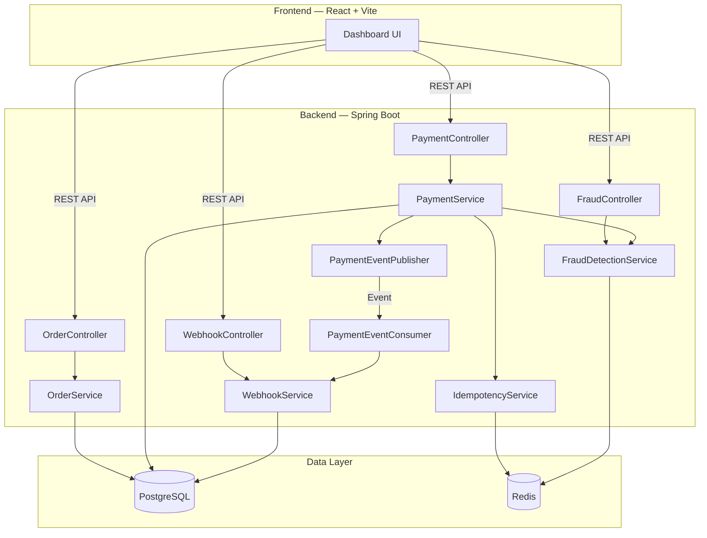
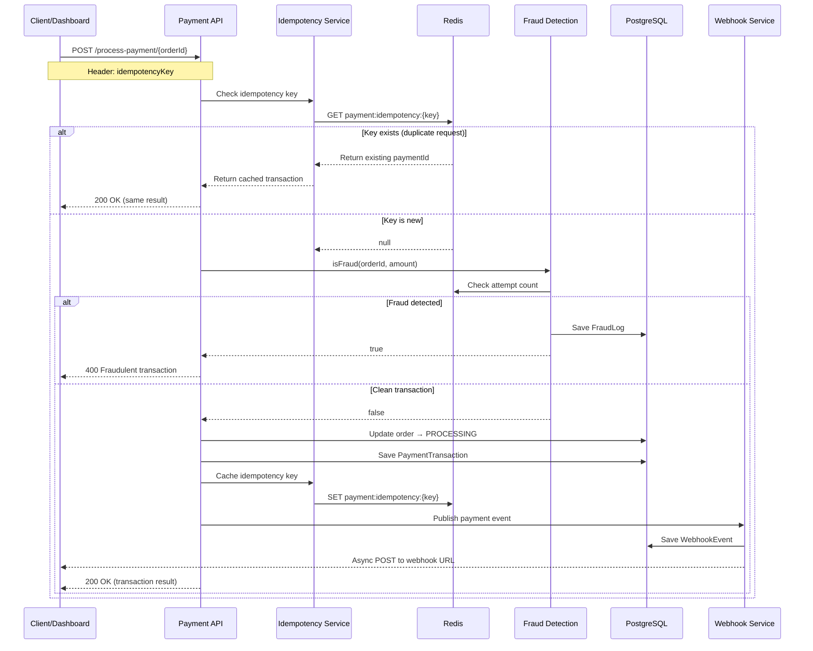
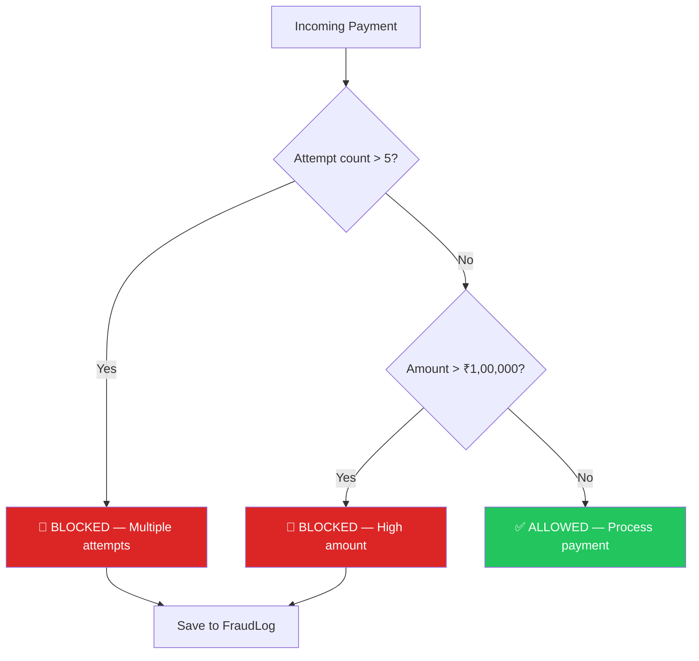

<div align="center">

# ⚡ PayNova

### A Production-Grade Payment Gateway System

[](https://openjdk.org/)
[](https://spring.io/projects/spring-boot)
[](https://redis.io/)
[](https://www.postgresql.org/)
[](https://www.docker.com/)
[](https://react.dev/)

**A simplified payment gateway system that demonstrates how modern payment platforms process payments securely using idempotency, distributed caching, fraud detection, and event-driven architecture.**

[Getting Started](#-getting-started) · [API Reference](#-api-endpoints) · [Architecture](#-architecture-overview) · [Dashboard](#-frontend-dashboard)

</div>

---

## 📖 About

PayNova simulates real-world payment gateway concepts — safe payment retries, idempotency handling, fraud detection, HMAC-signed webhooks, and a full merchant dashboard UI.

Built with **Java / Spring Boot** on the backend and a **React + Vite** dashboard on the frontend.

---

## ✨ Features

| Category | Feature |
|----------|---------|
| **Payments** | Order creation, payment processing, status tracking |
| **Idempotency** | Redis-backed idempotency keys prevent duplicate charges |
| **Fraud Detection** | Rate-limiting (>5 attempts) + high-amount threshold (>₹1,00,000) |
| **Webhooks** | Async delivery with HMAC-SHA256 signatures, scheduled retries (max 5) |
| **Event System** | Publisher/Consumer pattern for payment lifecycle events |
| **Dashboard** | Full React merchant dashboard — orders, payments, webhooks, fraud logs |
| **Deployment** | Dockerized backend, Render-ready config |

---

## 🏗 Architecture Overview



---

## 🔄 Payment Processing Flow



---

## 🛡 Fraud Detection Logic



---

## 🛠 Tech Stack

### Backend
| Technology | Purpose |
|-----------|---------|
| Java 17 | Core language |
| Spring Boot 4.0 | Web framework |
| Spring Data JPA | ORM / data access |
| Spring Data Redis | Distributed caching |
| PostgreSQL | Primary database |
| Redis | Idempotency keys, fraud rate-limiting |
| Gradle | Build tool |
| Lombok | Boilerplate reduction |
| Docker | Containerization |

### Frontend
| Technology | Purpose |
|-----------|---------|
| React 19 | UI library |
| Vite | Dev server & bundler |
| Chart.js | Dashboard charts |
| Vanilla CSS | Custom styling |

---

## 📡 API Endpoints

### Orders

| Method | Endpoint | Description |
|--------|----------|-------------|
| `POST` | `/orders` | Create a new order |
| `GET` | `/orders` | List all orders |
| `GET` | `/orders/{id}` | Get order by ID |

### Payments

| Method | Endpoint | Description |
|--------|----------|-------------|
| `POST` | `/process-payment/{orderId}` | Process payment for an order |
| `GET` | `/payments` | List all payments |
| `GET` | `/payments/{id}` | Get payment by ID |
| `GET` | `/payments/stats` | Get dashboard statistics |

### Webhooks

| Method | Endpoint | Description |
|--------|----------|-------------|
| `GET` | `/webhook/all` | List all webhook events |
| `POST` | `/webhook/verify` | Verify webhook signature |

### Fraud Detection

| Method | Endpoint | Description |
|--------|----------|-------------|
| `GET` | `/frauds` | List all fraud logs |

### Example — Create Order

```bash
curl -X POST http://localhost:8081/orders \
  -H "Content-Type: application/json" \
  -H "idempotencyKey: $(uuidgen)" \
  -d '{"amount": 5000, "currency": "INR"}'
```

### Example — Process Payment

```bash
curl -X POST http://localhost:8081/process-payment/1 \
  -H "Content-Type: application/json" \
  -H "idempotencyKey: $(uuidgen)"
```

---

## 🎨 Frontend Dashboard

The PayNova dashboard provides a full merchant interface for monitoring and managing payments.

| Page | Features |
|------|----------|
| **Dashboard** | Stat cards, bar chart, doughnut chart |
| **Orders** | Create orders, view status, trigger payments |
| **Payments** | Filter by status (Success / Failed / Processing) |
| **Webhooks** | Delivery log with retry count tracking |
| **Fraud Logs** | View flagged/blocked transactions with reasons |
| **Settings** | API credentials, webhook config, backend connection status |

---

## 🚀 Getting Started

### Prerequisites

- Java 17+
- Redis (running on localhost:6379)
- PostgreSQL
- Node.js 18+ (for frontend)

### 1️⃣ Clone the Repositories

```bash
# Backend
git clone https://github.com/harsh00789/payment-gateway.git

# Frontend (Dashboard UI)
git clone https://github.com/harsh00789/payment-gateway-ui.git
```

### 2️⃣ Start Redis

```bash
docker run -d -p 6379:6379 redis
```

### 3️⃣ Run the Backend

```bash
cd payment-gateway/payment/payment
./gradlew bootRun
```

The API will be available at `http://localhost:8081`

### 4️⃣ Run the Frontend

```bash
cd payment-gateway-ui
npm install
npm run dev
```

The dashboard will be available at `http://localhost:5173`

### 🐳 Running with Docker

```bash
# Build the image
docker build -t paynova .

# Run the container
docker run -p 8080:8080 paynova
```

---

## 🔑 Key Concepts

### Idempotency
Every payment request requires an `idempotencyKey` header. If the same key is sent twice, the server returns the original response without reprocessing — preventing duplicate charges.

### Fraud Detection
Two-layer fraud check before processing:
1. **Rate limiting** — If an order has >5 payment attempts, it's flagged
2. **Amount threshold** — Transactions over ₹1,00,000 are blocked

Both rules log to the `FraudLog` table for audit.

### Webhook Delivery
After payment processing, PayNova sends webhook events to the registered URL:
- Events are signed with **HMAC-SHA256** for authenticity
- Failed deliveries are automatically **retried every 10 seconds** (up to 5 attempts)
- Recipients verify via the `X-Signature` header

### Event-Driven Architecture
Payment lifecycle uses a publisher/consumer pattern:
- `PaymentEventPublisher` fires events after transaction completion
- `PaymentEventConsumer` handles downstream work (webhook creation, notifications)

---

## 📈 Future Improvements

- [ ] Add JWT-based authentication and authorization
- [ ] Implement rate limiting at API gateway level
- [ ] Add message queue (RabbitMQ/Kafka) for async processing
- [ ] Enhance fraud detection with ML-based risk scoring
- [ ] Add payment status tracking with real-time updates
- [ ] Implement database migration with Flyway
- [ ] Add comprehensive test coverage

---

## 🎯 Learning Goals

This project demonstrates:
- Backend system design for payment platforms
- Idempotent API design patterns
- Distributed caching with Redis
- Event-driven architecture
- Fraud detection systems
- Webhook delivery with retry mechanisms
- HMAC signature verification
- Full-stack development with React + Spring Boot
- Docker containerization

---

## 👤 Author

**Harsh Thaker**
Software Engineer

[](https://github.com/harsh00789)

---

<div align="center">

**[Backend Repo](https://github.com/harsh00789/payment-gateway)** · **[Frontend Repo](https://github.com/harsh00789/payment-gateway-ui)**

Built with ☕ and ⚡ by [Harsh Thaker](https://github.com/harsh00789)

</div>
